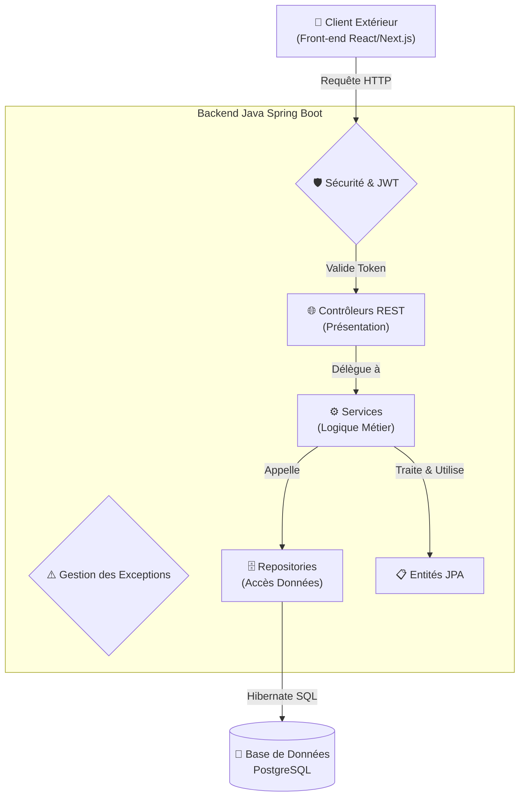

# 🎓 Projet Fil Rouge

Ce projet s'inscrit dans le cadre de notre formation de Concepteur Développeur d'Applications (CDA) et a pour vocation de numériser et centraliser la gestion de notes de l'établissement.

---

## 🏗️ Architecture du Projet

Notre application repose sur une architecture séparant clairement les responsabilités (Backend / Frontend / Base de Données).



### 1. Le Cœur du Système : Backend (API REST)
Le cœur logique de notre application est une API RESTful développée en **Java 25** avec le framework **Spring Boot 3**.
Nous avons opté pour une **architecture monolithique multicouche (N-Tier)**, idéale pour garantir la maintenabilité, la lisibilité et l'évolutivité du code :

*   **🌐 Couche de Présentation (`Controllers`) :** Expose nos endpoints REST. Elle réceptionne les requêtes HTTP, valide la structure des données entrantes et renvoie les réponses formatées en JSON.
*   **⚙️ Couche Métier (`Services`) :** Contient toute l'intelligence et les règles de gestion de l'école (ex: calculs des moyennes, règles d'assignation, interdiction de supprimer un formateur). Elle gère également la **transactionnalité** (`@Transactional`).
*   **🗄️ Couche d'Accès aux Données (`Repositories` & `Entities`) :** Gérée par **Spring Data JPA** et **Hibernate** (ORM). Les *Entities* mappent nos objets métiers vers les tables de la base de données, tandis que les *Repositories* exécutent les requêtes (CRUD, requêtes JPQL paramétrées) de manière sécurisée et fluide.

### 2. Persistance : Base de Données Relationnelle
Nous utilisons **PostgreSQL** (hébergé via Supabase) comme Système de Gestion de Base de Données Relationnel (SGBDR).
*   **Pourquoi PostgreSQL ?** Ce choix garantit une **intégrité référentielle stricte** (contrôle des clés étrangères et des contraintes métier directement en base). Nous déportons également une partie de la logique critique au plus près de la donnée via l'utilisation de **Triggers automatiques** (ex: pour recalculer automatiquement une moyenne lorsqu'une note est modifiée) et de **Procédures Stockées**.

### 3. Interface Client (Développement à venir)
L'application cliente, qui consommera cette API REST, sera développée dans l'écosystème **React**. La flexibilité de notre architecture d'API nous permet de reporter le choix technologique spécifique du front-end à une étape ultérieure du projet (application Web classique de type SPA avec *React JS / Next.js*, ou application orientée Mobile avec *React Native*), l'interface d'échange (JSON) restant strictement la même.

---

## 🚀 Pratiques de Développement (Approche Académique)

Dans le cadre de notre cursus CDA, voici les pratiques que nous nous efforçons d'appliquer :

*   **🔒 Sécurité "By Design" :** Notre API est sécurisée de bout en bout via **Spring Security**. L'authentification sera totalement *Stateless* (sans état) et s'appuiera sur la génération et la vérification de jetons cryptographiques **JWT (JSON Web Tokens)** fournis par le client à chaque requête. Les données sensibles (comme les mots de passe) seront systématiquement hachées en base de données.
*   **🛡️ Style Défensif & Gestion d'Erreurs :** Nous ne faisons jamais aveuglément confiance aux entrées. Des validations strictes sont opérées côté serveur. En cas de violation d'une règle métier (ex: "un élève ne peut avoir plus de 20/20"), des exceptions personnalisées (`BusinessRuleException`) seront levées et interceptées de manière globale (`@ControllerAdvice`) pour renvoyer des codes de statut HTTP cohérents.
*   **🧪 Qualité & Tests Unitaires :** La logique métier critique sera éprouvée par des tests unitaires automatisés utilisant **JUnit 5** et **Mockito** (pour simuler les accès à la base de données de manière isolée).

---

## 🛠️ Configuration & Installation

L'application nécessite la configuration d'un environnement de base de données local ou distant (Supabase) et la définition d'une clé secrète pour le hachage des JWT. Le fichier `application.properties` contient des **données sensibles** (mots de passe, clés secrètes) et est donc ignoré par Git.

### 1. Préparer l'environnement
Copiez le fichier d'exemple fourni pour créer votre propre configuration locale :
```bash
cp src/main/resources/application.properties.example src/main/resources/application.properties
```

### 2. Configurer les identifiants
Ouvrez le fichier `application.properties` nouvellement créé et remplacez les valeurs d'exemple par vos vraies *credentials* :
*   `spring.datasource.url` : Modifiez l'hôte (ex: `jdbc:postgresql://VOTRE_HOST:5432/postgres`)
*   `spring.datasource.username` : Votre identifiant DB
*   `spring.datasource.password` : Votre mot de passe DB
*   `jwt.secret` : En production, générez une clé aléatoire forte (ex: via la commande `openssl rand -base64 64`).

### 3. Lancer l'application
Assurez-vous d'avoir Maven ou le wrapper Maven installé. À la racine du dossier `backend`, exécutez :
```bash
mvn spring-boot:run
```
*(Le serveur se lancera par défaut sur le port 8080).*

> **⚠️ Attention : Ne commitez JAMAIS votre fichier `application.properties` configuré avec vos vrais mots de passe !**
